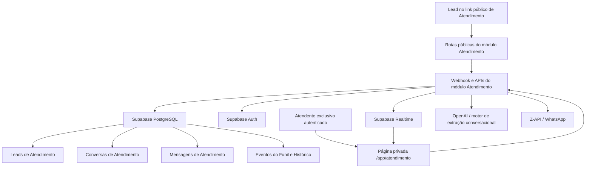
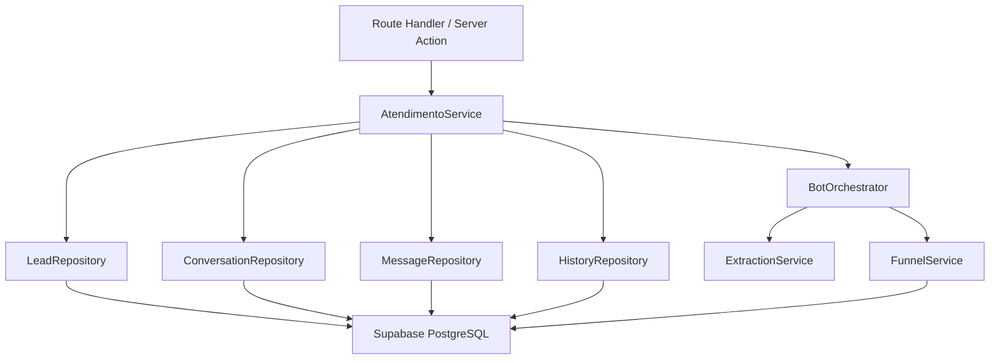
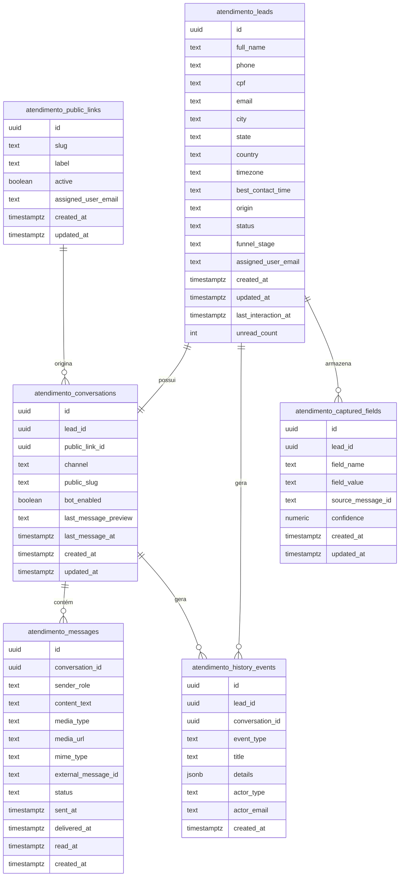

## 1. Desenho de Arquitetura



## 2. Descrição da Tecnologia

- Frontend: Next.js 15 + React + TypeScript + Tailwind
- Backend: Route Handlers e Server Actions do próprio projeto Next.js
- Banco de dados: Supabase PostgreSQL com RLS
- Realtime: Supabase Realtime para sincronização de mensagens, contadores e mudanças de etapa
- IA conversacional: OpenAI para extração de dados estruturados e classificação de etapa
- Canal externo: Z-API / WhatsApp para entrega e recepção de mensagens do atendimento

## 3. Definições de Rotas

| Rota | Finalidade |
|------|------------|
| `/app/atendimento` | Tela privada única do CRM de Atendimento, exclusiva para `atendimento.usa.music@gmail.com` |
| `/atendimento` | Link público de entrada do lead para iniciar a conversa automática do bot |
| `/api/atendimento/leads` | Buscar lista de leads com filtros, paginação e indicadores de não lidas |
| `/api/atendimento/leads/[leadId]` | Buscar detalhes do lead, perfil resumido e histórico consolidado |
| `/api/atendimento/conversas/[conversationId]/messages` | Listar mensagens da conversa com paginação temporal |
| `/api/atendimento/conversas/[conversationId]/send` | Enviar mensagem manual do atendente quando aplicável |
| `/api/atendimento/link-publico` | Obter e regenerar o link público do atendimento |
| `/api/atendimento/resumo` | Buscar métricas do painel resumo |
| `/api/atendimento/filtros` | Fornecer opções de filtros e contagens agregadas |
| `/api/atendimento/webhook/zapi` | Receber mensagens, mídias e eventos de status do WhatsApp |
| `/api/atendimento/bot/process` | Processar a próxima ação automática do bot e avanço do funil |

## 4. Definições de API

### 4.1 Tipos Principais

```ts
type AtendimentoLeadStatus =
  | "novo_lead"
  | "em_atendimento"
  | "matricula_pendente"
  | "matriculado"
  | "encerrado";

type AtendimentoFunnelStage =
  | "novo_lead"
  | "em_atendimento"
  | "metodologia_apresentada"
  | "aula_experimental_convidada"
  | "aula_experimental_agendada"
  | "pre_cadastro_concluido"
  | "matricula_pendente"
  | "matriculado"
  | "encerrado";

type AtendimentoMessageStatus = "enviada" | "entregue" | "lida" | "recebida";

type AtendimentoMessageMediaType =
  | "text"
  | "audio"
  | "image"
  | "document"
  | "file";

type AtendimentoLead = {
  id: string;
  full_name: string | null;
  phone: string;
  cpf: string | null;
  email: string | null;
  city: string | null;
  state: string | null;
  country: string | null;
  timezone: string | null;
  best_contact_time: string | null;
  origin: string;
  status: AtendimentoLeadStatus;
  funnel_stage: AtendimentoFunnelStage;
  assigned_user_email: string;
  created_at: string;
  updated_at: string;
  last_interaction_at: string | null;
  unread_count: number;
};

type AtendimentoConversation = {
  id: string;
  lead_id: string;
  public_slug: string;
  channel: "whatsapp";
  bot_enabled: boolean;
  last_message_preview: string | null;
  last_message_at: string | null;
  created_at: string;
  updated_at: string;
};

type AtendimentoMessage = {
  id: string;
  conversation_id: string;
  sender_role: "lead" | "bot" | "attendant" | "system";
  content_text: string | null;
  media_type: AtendimentoMessageMediaType;
  media_url: string | null;
  mime_type: string | null;
  external_message_id: string | null;
  status: AtendimentoMessageStatus;
  sent_at: string | null;
  delivered_at: string | null;
  read_at: string | null;
  created_at: string;
};

type AtendimentoHistoryEvent = {
  id: string;
  lead_id: string;
  conversation_id: string | null;
  event_type:
    | "message_received"
    | "message_sent"
    | "stage_changed"
    | "status_changed"
    | "data_captured"
    | "lead_updated"
    | "appointment_recorded"
    | "owner_changed";
  title: string;
  details: Record<string, unknown> | null;
  actor_type: "bot" | "lead" | "attendant" | "system";
  actor_email: string | null;
  created_at: string;
};
```

### 4.2 Contratos Principais

| Endpoint | Método | Entrada | Saída |
|----------|--------|---------|-------|
| `/api/atendimento/leads` | `GET` | filtros por nome, telefone, CPF, status, etapa, criação, última interação | lista paginada de leads + total |
| `/api/atendimento/leads/[leadId]` | `GET` | `leadId` | lead consolidado + conversa ativa + histórico resumido |
| `/api/atendimento/conversas/[conversationId]/messages` | `GET` | `conversationId`, cursor temporal | mensagens da conversa em ordem cronológica |
| `/api/atendimento/conversas/[conversationId]/send` | `POST` | texto ou mídia enviada pelo atendente | mensagem persistida + evento de histórico |
| `/api/atendimento/link-publico` | `GET` | sem entrada | URL pública do atendimento |
| `/api/atendimento/resumo` | `GET` | sem entrada | contadores agregados do painel resumo |
| `/api/atendimento/webhook/zapi` | `POST` | payload do provedor | confirmação do processamento do evento |
| `/api/atendimento/bot/process` | `POST` | `conversationId` ou lote agendado | próxima ação do bot e atualizações de lead |

## 5. Diagrama da Arquitetura de Servidor



## 6. Modelo de Dados

### 6.1 Definição do Modelo de Dados



### 6.2 Linguagem de Definição de Dados

```sql
create table if not exists public.atendimento_public_links (
  id uuid primary key default gen_random_uuid(),
  slug text not null unique,
  label text not null default 'Link principal de atendimento',
  active boolean not null default true,
  assigned_user_email text not null,
  created_at timestamptz not null default now(),
  updated_at timestamptz not null default now()
);

create table if not exists public.atendimento_leads (
  id uuid primary key default gen_random_uuid(),
  full_name text,
  phone text not null,
  cpf text,
  email text,
  city text,
  state text,
  country text,
  timezone text,
  best_contact_time text,
  origin text not null default 'link_publico_atendimento',
  status text not null default 'novo_lead',
  funnel_stage text not null default 'novo_lead',
  assigned_user_email text not null,
  created_at timestamptz not null default now(),
  updated_at timestamptz not null default now(),
  last_interaction_at timestamptz,
  unread_count integer not null default 0
);

create table if not exists public.atendimento_conversations (
  id uuid primary key default gen_random_uuid(),
  lead_id uuid not null,
  public_link_id uuid,
  channel text not null default 'whatsapp',
  public_slug text not null,
  bot_enabled boolean not null default true,
  last_message_preview text,
  last_message_at timestamptz,
  created_at timestamptz not null default now(),
  updated_at timestamptz not null default now()
);

create table if not exists public.atendimento_messages (
  id uuid primary key default gen_random_uuid(),
  conversation_id uuid not null,
  sender_role text not null,
  content_text text,
  media_type text not null default 'text',
  media_url text,
  mime_type text,
  external_message_id text,
  status text not null default 'enviada',
  sent_at timestamptz,
  delivered_at timestamptz,
  read_at timestamptz,
  created_at timestamptz not null default now()
);

create table if not exists public.atendimento_history_events (
  id uuid primary key default gen_random_uuid(),
  lead_id uuid not null,
  conversation_id uuid,
  event_type text not null,
  title text not null,
  details jsonb,
  actor_type text not null,
  actor_email text,
  created_at timestamptz not null default now()
);

create table if not exists public.atendimento_captured_fields (
  id uuid primary key default gen_random_uuid(),
  lead_id uuid not null,
  field_name text not null,
  field_value text,
  source_message_id text,
  confidence numeric(4,3),
  created_at timestamptz not null default now(),
  updated_at timestamptz not null default now()
);

create index if not exists atendimento_leads_phone_idx
  on public.atendimento_leads (phone);

create index if not exists atendimento_leads_status_idx
  on public.atendimento_leads (status, funnel_stage);

create index if not exists atendimento_leads_last_interaction_idx
  on public.atendimento_leads (last_interaction_at desc nulls last);

create index if not exists atendimento_messages_conversation_idx
  on public.atendimento_messages (conversation_id, created_at desc);

create index if not exists atendimento_history_events_lead_idx
  on public.atendimento_history_events (lead_id, created_at desc);

alter table public.atendimento_public_links enable row level security;
alter table public.atendimento_leads enable row level security;
alter table public.atendimento_conversations enable row level security;
alter table public.atendimento_messages enable row level security;
alter table public.atendimento_history_events enable row level security;
alter table public.atendimento_captured_fields enable row level security;

grant select, insert, update, delete on public.atendimento_public_links to authenticated;
grant select, insert, update, delete on public.atendimento_leads to authenticated;
grant select, insert, update, delete on public.atendimento_conversations to authenticated;
grant select, insert, update, delete on public.atendimento_messages to authenticated;
grant select, insert, update, delete on public.atendimento_history_events to authenticated;
grant select, insert, update, delete on public.atendimento_captured_fields to authenticated;

grant select, insert on public.atendimento_public_links to anon;
grant select, insert on public.atendimento_leads to anon;
grant select, insert on public.atendimento_conversations to anon;
grant select, insert on public.atendimento_messages to anon;

create policy atendimento_public_links_authenticated_only
  on public.atendimento_public_links
  for all
  to authenticated
  using (auth.jwt() ->> 'email' = 'atendimento.usa.music@gmail.com')
  with check (auth.jwt() ->> 'email' = 'atendimento.usa.music@gmail.com');

create policy atendimento_leads_authenticated_only
  on public.atendimento_leads
  for all
  to authenticated
  using (auth.jwt() ->> 'email' = 'atendimento.usa.music@gmail.com')
  with check (auth.jwt() ->> 'email' = 'atendimento.usa.music@gmail.com');

create policy atendimento_conversations_authenticated_only
  on public.atendimento_conversations
  for all
  to authenticated
  using (auth.jwt() ->> 'email' = 'atendimento.usa.music@gmail.com')
  with check (auth.jwt() ->> 'email' = 'atendimento.usa.music@gmail.com');

create policy atendimento_messages_authenticated_only
  on public.atendimento_messages
  for all
  to authenticated
  using (auth.jwt() ->> 'email' = 'atendimento.usa.music@gmail.com')
  with check (auth.jwt() ->> 'email' = 'atendimento.usa.music@gmail.com');

create policy atendimento_history_events_authenticated_only
  on public.atendimento_history_events
  for all
  to authenticated
  using (auth.jwt() ->> 'email' = 'atendimento.usa.music@gmail.com')
  with check (auth.jwt() ->> 'email' = 'atendimento.usa.music@gmail.com');

create policy atendimento_captured_fields_authenticated_only
  on public.atendimento_captured_fields
  for all
  to authenticated
  using (auth.jwt() ->> 'email' = 'atendimento.usa.music@gmail.com')
  with check (auth.jwt() ->> 'email' = 'atendimento.usa.music@gmail.com');
```

## 7. Estratégia de Implementação

- Fase 1: estrutura visual da página única de Atendimento, link público, lista de leads, layout da conversa e painel lateral.
- Fase 2: persistência do módulo com tabelas próprias e rotas de leitura/escrita.
- Fase 3: webhook de mensagens, sincronização em tempo real e histórico completo.
- Fase 4: orquestração do bot, extração automática de dados e avanço do funil.
- Fase 5: refinamento operacional, filtros avançados, métricas e testes de regressão.

## 8. Restrições Técnicas e de Escopo

- O módulo deve permanecer isolado de `Clientes`, `Agendar`, `Mensagens`, `Dashboard` e outros fluxos existentes.
- O menu e a página privada devem existir apenas para `atendimento.usa.music@gmail.com`.
- O administrador `heybrotherscolaboradores@gmail.com` não deve ver nem acessar esse módulo.
- Toda persistência do CRM deve usar tabelas dedicadas ao domínio `atendimento_*`.
- O link público pode ser externo à área autenticada, mas continua sendo parte do mesmo módulo `Atendimento`.
