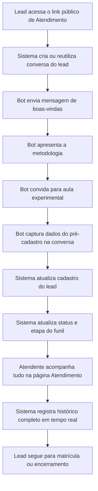

## 1. Visão do Produto

O módulo `Atendimento` será um CRM exclusivo para captação, acompanhamento e conversão de novos alunos do projeto Lucas Brum Online Music USA, centralizando conversa, funil, cadastro e histórico no próprio AutoBot.

- Resolve a necessidade de operar toda a jornada do lead em um único lugar, sem depender de `Clientes`, `Agendar`, páginas extras ou processos externos.
- Gera valor ao transformar o fluxo de captação em um pipeline rastreável, automatizado pelo bot e editável pelo atendente responsável.

## 2. Funcionalidades Centrais

### 2.1 Papéis de Usuário

| Papel | Método de acesso | Permissões principais |
|------|-------------------|-----------------------|
| Atendente exclusivo | Login com `atendimento.usa.music@gmail.com` | Visualizar menu Atendimento, acessar CRM, acompanhar conversas, confirmar progresso do funil |
| Lead público | Link público de atendimento | Iniciar conversa com o bot, enviar mensagens, áudios, imagens e documentos |
| Demais usuários | Login padrão do AutoBot | Não visualizam menu, rota, dados ou referências do módulo Atendimento |

### 2.2 Módulos do Produto

1. **Página Atendimento**: painel único com resumo, link público, filtros, lista de atendimentos e conversa ativa.
2. **Conversa do Lead**: experiência estilo WhatsApp dentro do módulo, com histórico completo e mídia.
3. **Bot de Captação**: fluxo automático de boas-vindas, metodologia, convite para aula experimental e pré-cadastro.
4. **Cadastro Inteligente de Lead**: persistência automática dos dados capturados sem formulários manuais.
5. **Funil de Atendimento**: atualização automática de status e etapa com histórico completo.
6. **Tempo Real**: sincronização de novas mensagens, leituras, alterações de etapa e indicadores.

### 2.3 Detalhamento das Páginas

| Página | Módulo | Descrição funcional |
|-------|--------|---------------------|
| Atendimento | Painel resumo | Exibe total de leads, novos leads, leads em atendimento, aulas experimentais agendadas, matrículas pendentes, matriculados e conversas não lidas |
| Atendimento | Link público | Mostra o link público de captação e botão de copiar link |
| Atendimento | Lista de atendimentos | Lista leads em formato de conversa com nome, telefone, última mensagem, última interação, status, etapa do funil e não lidas |
| Atendimento | Pesquisa e filtros | Permite buscar por nome, telefone, CPF, status, etapa, data de criação e última interação |
| Atendimento | Conversa ativa | Mostra histórico completo com mensagens do bot e do lead, timestamps, status de envio, áudios, imagens, documentos e eventos |
| Atendimento | Perfil do lead | Exibe dados capturados automaticamente, origem, responsável, timezone e resumo da etapa atual |
| Atendimento | Timeline de histórico | Registra mensagens, mudanças de etapa, dados capturados, alterações cadastrais e ações automáticas do bot |
| Link público de Atendimento | Entrada pública do lead | Abre conversa automática do bot sem exigir login e cria o lead dentro do módulo Atendimento |

## 3. Processo Central

O fluxo principal começa com o lead acessando o link público de atendimento. O bot inicia a conversa automaticamente, conduz a jornada prevista, captura os dados relevantes de forma conversacional e atualiza o cadastro do lead. Ao mesmo tempo, o atendente exclusivo acompanha em tempo real a lista de atendimentos, abre a conversa de qualquer lead, visualiza o histórico, acompanha a etapa do funil e mantém o caso dentro do módulo até a matrícula ou encerramento.

O sistema deve sempre manter três visões sincronizadas: a conversa, o cadastro do lead e o histórico operacional. Qualquer mensagem recebida ou enviada precisa refletir imediatamente no painel, no contador de não lidas, no resumo e na etapa do funil correspondente.

## 4. Design da Interface

### 4.1 Estilo Visual

- Paleta principal: base escura do app atual com acentos em verde-água, azul petróleo e âmbar para estados operacionais.
- Estilo de botões: arredondados, densidade média, com foco forte em ações principais como copiar link, abrir conversa e filtrar.
- Tipografia: manter coerência com o sistema atual, priorizando leitura rápida em listas densas e conversa em tempo real.
- Layout: desktop-first com três áreas principais na mesma página: resumo superior, lista lateral de atendimentos e conversa detalhada.
- Ícones: `lucide-react`, com linguagem de CRM conversacional e prioridade para clareza operacional.

### 4.2 Visão de UI por Módulo

| Página | Módulo | Elementos de UI |
|-------|--------|-----------------|
| Atendimento | Topo operacional | Título, descrição, link público, botão copiar e cartões-resumo |
| Atendimento | Barra de filtros | Campo de pesquisa, filtros por status, etapa, datas e não lidas |
| Atendimento | Lista de atendimentos | Itens estilo inbox com avatar, nome, telefone, snippet da última mensagem, badges, timestamp e contador de não lidas |
| Atendimento | Conversa ativa | Bolhas de mensagem, anexos, player de áudio, visualização de imagem, documentos, indicadores de envio/entrega/leitura |
| Atendimento | Painel lateral do lead | Card com dados capturados, origem, timezone, responsável, status, etapa e ações futuras |
| Atendimento | Timeline | Lista cronológica de eventos automáticos e manuais |
| Link público de Atendimento | Conversa pública | Interface simplificada e focada na conversa inicial com o bot |

### 4.3 Responsividade

- Abordagem desktop-first.
- Em telas grandes: lista de atendimentos à esquerda, conversa no centro e contexto do lead à direita.
- Em telas médias: painel do lead pode colapsar abaixo da conversa.
- Em mobile: alternância entre lista e conversa com cabeçalho fixo e indicadores visíveis.
- Interações devem ser otimizadas para toque, incluindo anexos, reprodução de áudio e abertura de documentos.

## 5. Regras de Negócio

- O menu `Atendimento` e todas as suas rotas privadas devem ser acessíveis exclusivamente por `atendimento.usa.music@gmail.com`.
- O administrador `heybrotherscolaboradores@gmail.com` e qualquer outro usuário não podem visualizar ou acessar o módulo.
- Nenhum lead deste fluxo deve ser criado em `Clientes`, `Agendar` ou qualquer outro módulo existente.
- Toda a jornada deve acontecer no módulo `Atendimento`, incluindo captação, conversa, pré-cadastro, acompanhamento, histórico e conversão.
- O bot deve conduzir automaticamente as etapas:
  - Entrada do Lead
  - Mensagem de boas-vindas
  - Apresentação da metodologia
  - Convite para aula experimental
  - Pré-cadastro automático
- O sistema deve capturar automaticamente, pela conversa:
  - Nome completo
  - Telefone
  - CPF
  - E-mail
  - Cidade
  - Estado
  - País
  - Timezone
  - Melhor horário para contato
- Cada lead deve ter cadastro persistido com:
  - ID
  - Nome
  - Telefone
  - CPF
  - E-mail
  - Cidade
  - Estado
  - País
  - Timezone
  - Origem do lead
  - Data de criação
  - Status
  - Etapa do funil
  - Responsável pelo atendimento
- O funil de atendimento deve suportar as etapas:
  - Novo Lead
  - Em Atendimento
  - Metodologia Apresentada
  - Aula Experimental Convidada
  - Aula Experimental Agendada
  - Pré-Cadastro Concluído
  - Matrícula Pendente
  - Matriculado
  - Encerrado

## 6. Métricas e Indicadores

- Total de Leads
- Novos Leads
- Em Atendimento
- Aulas Experimentais Agendadas
- Matrículas Pendentes
- Alunos Matriculados
- Conversas Não Lidas

## 7. Registro e Auditoria

O histórico deve registrar automaticamente:

- Todas as mensagens
- Mudanças de etapa
- Dados capturados
- Agendamentos relacionados à aula experimental
- Alterações cadastrais
- Responsável pelo atendimento
- Data e horário de cada ação

## 8. Escopo da Primeira Implementação

Nesta etapa de implementação, o módulo deve ser construído exclusivamente dentro de `Atendimento`, preservando isolamento completo em relação aos módulos já existentes do AutoBot.

- Não reutilizar páginas externas para cadastro, conversa ou acompanhamento.
- Não criar menu adicional além de `Atendimento`.
- Não distribuir o fluxo em `Clientes`, `Agendar`, `Mensagens`, `Dashboard` ou outros módulos.
