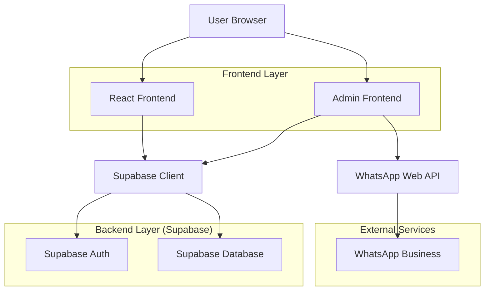
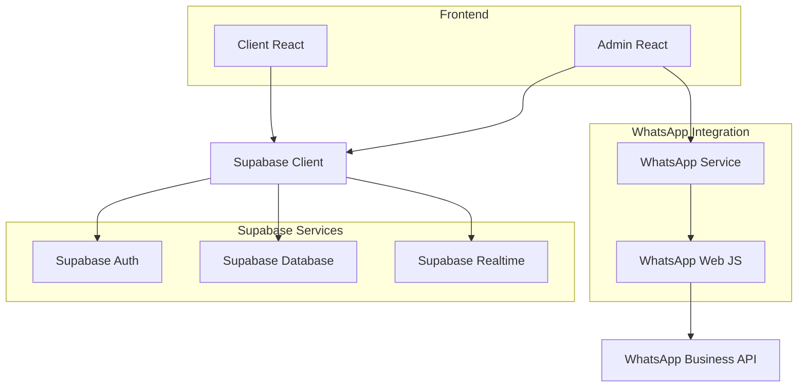
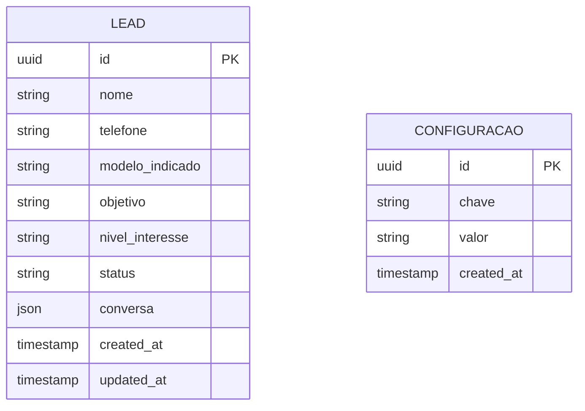

## 1. Architecture design



## 2. Technology Description
- Frontend: React@18 + tailwindcss@3 + vite
- Initialization Tool: vite-init
- Backend: Supabase (PostgreSQL + Auth + Realtime)
- WhatsApp Integration: WhatsApp Web JS
- Database: Supabase PostgreSQL

## 3. Route definitions
| Route | Purpose |
|-------|---------|
| / | Chat principal do bot para interação com leads |
| /admin | Painel administrativo com dashboard de leads |
| /admin/login | Tela de login do administrador |

## 4. API definitions

### 4.1 Supabase Database APIs

**Inserir Lead**
```javascript
const { data, error } = await supabase
  .from('leads')
  .insert([
    {
      nome: 'João Silva',
      telefone: '6599851142',
      modelo_indicado: 'hibrido',
      objetivo: 'Perder peso',
      nivel_interesse: 'quente',
      status: 'novo',
      conversa: [{tipo: 'bot', mensagem: 'Olá!'}]
    }
  ])
```

**Listar Leads (Admin)**
```javascript
const { data, error } = await supabase
  .from('leads')
  .select('*')
  .order('created_at', { ascending: false })
```

**Atualizar Status Lead**
```javascript
const { data, error } = await supabase
  .from('leads')
  .update({ status: 'atendimento' })
  .eq('id', lead_id)
```

### 4.2 WhatsApp Web Integration

**Conectar WhatsApp**
```javascript
POST /api/whatsapp/connect
Response: { qrCode: string, status: string }
```

**Enviar Mensagem Lead**
```javascript
POST /api/whatsapp/send-lead
{
  telefone: '6599851142',
  nome: 'João Silva',
  modelo: 'hibrido',
  objetivo: 'Perder peso',
  interesse: 'quente'
}
```

**Verificar Status**
```javascript
GET /api/whatsapp/status
Response: { connected: boolean }
```

## 5. Server architecture diagram



## 6. Data model

### 6.1 Data model definition



### 6.2 Data Definition Language

**Tabela Leads**
```sql
-- create table
CREATE TABLE leads (
    id UUID PRIMARY KEY DEFAULT gen_random_uuid(),
    nome VARCHAR(100) NOT NULL,
    telefone VARCHAR(20) NOT NULL,
    modelo_indicado VARCHAR(20) CHECK (modelo_indicado IN ('hibrido', 'individual')),
    objetivo TEXT,
    nivel_interesse VARCHAR(20) CHECK (nivel_interesse IN ('quente', 'morno', 'frio')),
    status VARCHAR(20) DEFAULT 'novo' CHECK (status IN ('novo', 'atendimento', 'finalizado')),
    conversa JSONB DEFAULT '[]',
    created_at TIMESTAMP WITH TIME ZONE DEFAULT NOW(),
    updated_at TIMESTAMP WITH TIME ZONE DEFAULT NOW()
);

-- create indexes
CREATE INDEX idx_leads_telefone ON leads(telefone);
CREATE INDEX idx_leads_status ON leads(status);
CREATE INDEX idx_leads_nivel_interesse ON leads(nivel_interesse);
CREATE INDEX idx_leads_created_at ON leads(created_at DESC);

-- grant permissions
GRANT SELECT ON leads TO anon;
GRANT ALL PRIVILEGES ON leads TO authenticated;
```

**Tabela Configurações**
```sql
-- create table
CREATE TABLE configuracoes (
    id UUID PRIMARY KEY DEFAULT gen_random_uuid(),
    chave VARCHAR(50) UNIQUE NOT NULL,
    valor TEXT,
    created_at TIMESTAMP WITH TIME ZONE DEFAULT NOW(),
    updated_at TIMESTAMP WITH TIME ZONE DEFAULT NOW()
);

-- insert default WhatsApp number
INSERT INTO configuracoes (chave, valor) VALUES 
('whatsapp_numero', '65 9985-1142'),
('whatsapp_conectado', 'false');

-- grant permissions
GRANT SELECT ON configuracoes TO anon;
GRANT ALL PRIVILEGES ON configuracoes TO authenticated;
```

**Realtime Subscriptions**
```sql
-- enable realtime for leads table
ALTER TABLE leads REPLICA IDENTITY FULL;

-- create policy for realtime updates
CREATE POLICY "Leads realtime" ON leads
    FOR ALL USING (true);
```