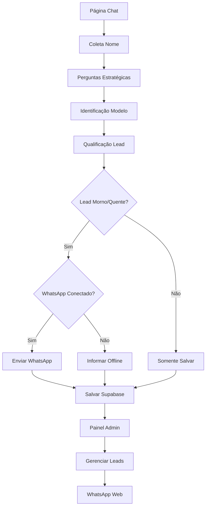

## 1. Product Overview

Sistema de atendimento automatizado via chat para qualificação de leads e indicação de modelos de ensino. O WeBooter automatiza a conversação inicial com potenciais clientes, qualifica seus interesses e encaminha leads qualificados para WhatsApp.

## 2. Core Features

### 2.1 User Roles

| Role   | Registration Method           | Core Permissions           |                                               |
| ------ | ----------------------------- | -------------------------- | :------------------------------------------------- |
|   | Lead (Visitante)              | Sem cadastro - apenas nome | Conversar com bot, receber indicação de modelo     |
| Admin  | Login fixo: webooter / I4l94W | 9R=v{                      | Acessar painel, gerenciar leads, conectar WhatsApp |

### 2.2 Feature Module

O sistema WeBooter consiste nas seguintes páginas principais:

1. **Chat do Bot**: Interface de conversação estilo WhatsApp com bot automatizado para qualificação de leads
2. **Painel Administrativo**: Dashboard com login fixo para gestão de leads e configuração do WhatsApp

### 2.3 Page Details

| Page Name    | Module Name             | Feature description                                                                                                      |                             |
| ------------ | ----------------------- | ------------------------------------------------------------------------------------------------------------------------ | :------------------------------- |
| Chat do Bot  | Interface de Conversa   | Campo de mensagem, exibição de mensagens em tempo real, rolagem automática, design estilo WhatsApp                       |                             |
| Chat do Bot  | Lógica do Bot           | Saudação inicial, coleta de nome, três perguntas estratégicas (objetivo, preferência de flexibilidade, tempo disponível) |                             |
| Chat do Bot  | Identificação de Modelo | Análise de respostas e indicação de apenas um modelo (Híbrido ou Individual) baseado nas preferências                    |                             |
| Chat do Bot  | Qualificação de Lead    | Classificação automática em Quente, Morno ou Frio baseado nas respostas e interesse demonstrado                          |                             |
| Chat do Bot  | Encaminhamento WhatsApp | Envio automático de dados do lead para WhatsApp (65 9985-1142) se classificado como Morno/Quente e WhatsApp conectado    |                             |
| Painel Admin | Login                   | Tela de login com credenciais fixas (webooter / I4l94W                                                                   | 9R=v{), sem recuperação de senha |
| Painel Admin | Lista de Leads          | Exibição em tempo real de leads com nome, telefone, modelo indicado, nível de interesse, status e data                   |                             |
| Painel Admin | Gerenciamento de Leads  | Visualização de conversa completa, alteração de status (novo/atendimento/finalizado), filtros por modelo e status        |                             |
| Painel Admin | WhatsApp Web            | Conexão via QR Code, status de conexão (conectado/desconectado), botão para abrir conversa com lead                      |                             |
| Painel Admin | Configurações           | Campo editável para número de encaminhamento WhatsApp (padrão: 65 9985-1142)                                             |                             |

## 3. Core Process

**Fluxo do Usuário (Lead):**

1. Usuário acessa a página principal e vê interface de chat
2. Bot envia saudação inicial e solicita nome
3. Bot faz três perguntas estratégicas uma por vez
4. Sistema analisa respostas e identifica modelo ideal (Híbrido ou Individual)
5. Bot apresenta apenas o modelo recomendado com detalhes
6. Sistema classifica lead como Quente, Morno ou Frio
7. Se Morno/Quente e WhatsApp conectado: envia dados para WhatsApp
8. Lead é salvo no Supabase com todos os dados da conversa

**Fluxo do Administrador:**

1. Admin faz login com credenciais fixas
2. Visualiza lista de leads em tempo real
3. Pode ver conversa completa de cada lead
4. Atualiza status dos leads (novo/atendimento/finalizado)
5. Conecta/desconecta WhatsApp Web via QR Code
6. Configura número de encaminhamento
7. Abre conversa no WhatsApp com leads qualificados

## 4. User Interface Design

### 4.1 Design Style

* **Cores Primárias**: Verde WhatsApp (#25D366, #128C7E)

* **Cores Secundárias**: Branco (#FFFFFF), Cinza claro (#ECE5DD)

* **Botões**: Estilo arredondado, sem bordas 3D

* **Fontes**: System fonts (San Francisco, Roboto, Segoe UI)

* **Tamanhos**: 14px para mensagens, 16px para títulos

* **Layout**: Card-based para chat, sidebar para painel admin

* **Ícones**: Emojis nativos e ícones minimalistas

### 4.2 Page Design Overview

| Page Name    | Module Name       | UI Elements                                                                                             |
| ------------ | ----------------- | ------------------------------------------------------------------------------------------------------- |
| Chat do Bot  | Área de Mensagens | Fundo cinza claro (#ECE5DD), balões de chat verde/branco, horário das mensagens, indicador de digitação |
| Chat do Bot  | Input de Mensagem | Barra inferior fixa, campo de texto arredondado, botão enviar com ícone de avião de papel               |
| Painel Admin | Sidebar           | Menu lateral escuro com ícones, logo no topo, logout no rodapé                                          |
| Painel Admin | Tabela de Leads   | Tabela zebra com hover, badges coloridos para status, botões de ação minimalistas                       |
| Painel Admin | Modal WhatsApp    | QR Code centralizado, status de conexão com ícone, botão de reconectar                                  |

### 4.3 Responsiveness

Desktop-first com adaptação mobile. Interface de chat otimizada para mobile com touch-friendly buttons. Painel admin principalmente para desktop com tabelas responsivas.
